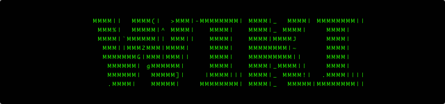

<article class="span8">
  
  

    <aside class="span2">
	
{{ post.date | date_to_string }}

	

	  <label>Tags:</label>{{ post.tags | array_to_sentence_string }}
	

	

	  <label>Category:</label>{{ post.category }}
	

    </aside>
    <article class="span6">
	
<a href="{{ BASE_PATH  }}{{ post.url  }}">{{ post.title  }}</a>

	
{{ post.description  }}

	
<a href="{{ BASE_PATH  }}{{ post.url  }} " class="btn">read more...</a>

    </article>

	
&nbsp;


  

  
</article>

<aside class="span4 ">

My Wiki

  
文章分类
 
  

	<ul class="tag_box">
	
	
	</ul>
  

</aside>

<a href="/archive.html">查看所有{{ site.posts.size  }}篇文章...</a>

